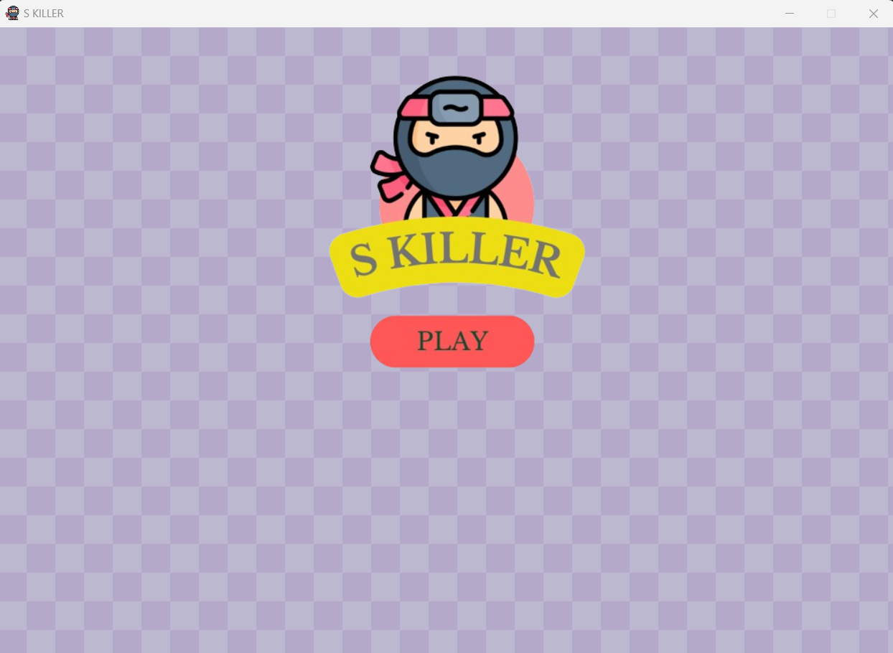

# S KILLER GAME

This is a simple killer game implemented in Python using **Pygame library**. In this simple game, you embody a shinobi.

## Table of Contents
- [Introduction](#introduction)
- [Features](#features)
- [Installation](#installation)
- [Controls](#controls)
- [Rules](#rules)
- [Contributing](#contributing)
- [Others](#others)

## Introduction
S KILLER or Shinobi Killer is a simple platformer game in which you can embody a shinobi. Your primary objective is to survive amidst various dangers, including enemies. Additionally, you have the ability to engage in combat with these enemies to increase your score and progress further in the game.

## Features

- **Classic Survival Gameplay:** S KILLER offers a classic survival gaming experience, where your agility and strategic thinking are put to the test.
- **User-friendly Interface:** The game boasts a user-friendly interface built with Pygame, ensuring smooth navigation and interaction for players of all skill levels.
- **Fluid Movement Mechanics:** Enjoy responsive movement controls that allow you to maneuver your shinobi avatar effortlessly through the game's challenges and obstacles.
- **Dynamic Combat System:** Engage in thrilling combat encounters with enemies scattered throughout the game world. Utilize your shinobi's martial prowess to defeat foes and advance in the game.
- **Life and Score Tracking:** Keep track of your progress with real-time indicators for remaining lives and current score. Monitor your performance and strive to achieve high scores with each playthrough.

## Installation
To embark on your shinobi adventure, follow these simple steps:
1. Ensure you have Python3 installed along with the Pygame library.
2. Download all the files from the repository.
3. Place all downloaded files in the same folder for easy access.
4. Run the `main.py` file.
5. Enjoy the thrilling gameplay experience!

## Controls
Master the controls to navigate the game world effectively:
- **Play Button/Space Key:** Initiate gameplay by clicking on the play button or pressing the space key.
- **Movement:** Use the arrow keys on your keyboard to move the player character.
- **Combat:** Engage in combat encounters by pressing the 'A' key on your keyboard.
- **Quit:** Exit the game at any time by clicking on the close icon.

## Rules 
To succeed in S KILLER, adhere to the following rules:
- **Starting Lives:** Begin the game with a total of 5 lives, symbolized by heart icons.
- **Life Reduction:** Lose one life if your character ventures outside the playing area.
- **Enemy Encounters:** Encounter enemy units throughout the game. Sustain a minor life reduction if touched by an enemy.
- **Scoring:** Earn one point for each enemy defeated, contributing to your overall score.

## Contributing
S KILLER welcomes contributions from the gaming community:
- **Feedback:** Provide feedback and suggestions to enhance the gameplay experience.
- **Bug Fixes:** Report any issues or bugs encountered during gameplay.
- **Enhancements:** Submit pull requests with improvements or additional features to enrich the game.

## Others 
Explore additional resources related to S KILLER:
- **Video Demo:** Watch a video demonstration of the gameplay experience [here](https://www.youtube.com/watch?v=SLT2Xq3L7jg).
- **Executable File:** Access a folder containing the executable file for convenient installation [here](https://drive.google.com/drive/folders/1Bbj8UocrM8y-QTQmxsdpr_huQWqLU0Rz?usp=sharing).
